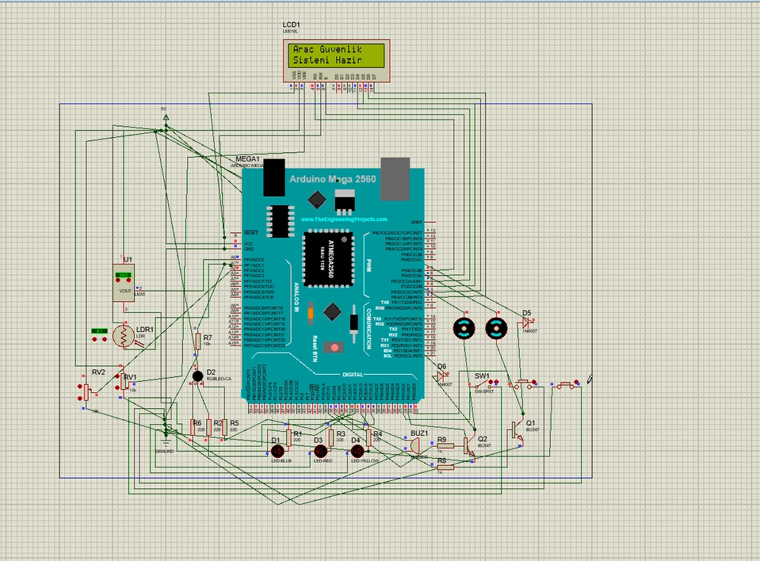

# 🚗 Arduino Car Security System

> Arduino Mega tabanlı araç güvenlik ve izleme sistemi — Proteus simülasyonu ile test edilmiştir.


<p align="center">
  
</p>

---

## 📋 İçindekiler

- [Proje Hakkında](#-proje-hakkında)
- [Özellikler](#-özellikler)
- [Donanım Bileşenleri](#-donanım-bileşenleri)
- [Devre Şeması & Pin Bağlantıları](#-devre-şeması--pin-bağlantıları)
- [Kurulum](#-kurulum)
- [Çalışma Mantığı](#-çalışma-mantığı)
- [Proteus Simülasyonu](#-proteus-simülasyonu)
- [Proje Yapısı](#-proje-yapısı)
- [İletişim](#-iletişim)

---

## 🔍 Proje Hakkında

Bu proje, bir aracın temel güvenlik fonksiyonlarını simüle eden gömülü sistem uygulamasıdır. Arduino Mega mikrodenetleyicisi kullanılarak geliştirilen sistem; motor kontrolü, emniyet kemeri takibi, kapı durumu izleme, yakıt seviyesi ölçümü, otomatik far kontrolü ve klima yönetimi gibi birçok güvenlik ve konfor özelliğini bir arada sunar.

Tüm sistem **Proteus 8 Professional** ortamında simüle edilerek doğrulanmıştır.

---

## ✨ Özellikler

### 🔐 Güvenlik Sistemi

| Özellik                        | Açıklama                                                                  |
| ------------------------------ | ------------------------------------------------------------------------- |
| **Motor Çalıştırma Koşulları** | Motor ancak emniyet kemeri takılıyken ve kapı kapalıyken çalıştırılabilir |
| **Kapı Açık Koruması**         | Kapı açılırsa motor otomatik olarak durur ve RGB LED pembe yanar          |
| **Emniyet Kemeri Uyarısı**     | Motor çalışırken kemer takılı değilse buzzer çalar ve kırmızı LED yanar   |
| **Yakıt Koruma Sistemi**       | Yakıt bittiğinde motor otomatik durur, tüm alt sistemler kapanır          |

### 🌡️ Konfor Sistemi

| Özellik            | Açıklama                                                         |
| ------------------ | ---------------------------------------------------------------- |
| **Otomatik Klima** | LM35 sensörü ile sıcaklık 25°C üzerindeyse klima otomatik açılır |
| **Otomatik Far**   | LDR sensörü ile ortam karanlıksa farlar otomatik açılır          |

### 📊 Yakıt İzleme

| Seviye             | Davranış                                                  |
| ------------------ | --------------------------------------------------------- |
| **%0 (Boş)**       | Motor durur, tüm sistemler kapanır, LCD'de "Yakıt Bitti!" |
| **< %5 (Kritik)**  | Sarı LED yanıp söner, LCD'de kritik yakıt uyarısı         |
| **< %10 (Düşük)**  | Sarı LED sürekli yanar, LCD'de düşük yakıt uyarısı        |
| **≥ %10 (Normal)** | LED söner, normal çalışma                                 |

### 📺 LCD Bilgi Ekranı

- **16x2 karakter LCD** üzerinde durum bilgisi gösterimi
- Birden fazla uyarı varsa **rotasyonlu uyarı sistemi** (3 saniyelik döngü)
- Far açma/kapama, motor durumu, sıcaklık ve yakıt bilgisi anlık gösterim
- Uyarı sayacı göstergesi (örn: 1/3, 2/3)

---

## 🔧 Donanım Bileşenleri

| Bileşen               | Miktar | Açıklama                         |
| --------------------- | ------ | -------------------------------- |
| Arduino Mega 2560     | 1      | Ana mikrodenetleyici             |
| 16x2 LCD Ekran        | 1      | Durum bilgisi gösterimi          |
| LM35 Sıcaklık Sensörü | 1      | Ortam sıcaklığı ölçümü           |
| LDR (Işık Sensörü)    | 1      | Ortam ışık seviyesi algılama     |
| Potansiyometre        | 1      | Yakıt seviyesi simülasyonu       |
| Push Button           | 2      | Motor ve emniyet kemeri kontrolü |
| Switch                | 1      | Kapı açık/kapalı simülasyonu     |
| Kırmızı LED           | 1      | Emniyet kemeri uyarısı           |
| Mavi LED              | 1      | Far göstergesi                   |
| Sarı LED              | 1      | Yakıt seviyesi göstergesi        |
| RGB LED               | 1      | Kapı açık uyarısı (pembe)        |
| Buzzer                | 1      | Sesli uyarı                      |
| DC Motor              | 2      | Motor ve klima fanı simülasyonu  |

---

## ⚡ Devre Şeması & Pin Bağlantıları

### Giriş Pinleri

| Pin | Bağlantı               | Tür            |
| --- | ---------------------- | -------------- |
| D22 | Motor Butonu           | `INPUT_PULLUP` |
| D23 | Emniyet Kemeri Butonu  | `INPUT_PULLUP` |
| D24 | Kapı Anahtarı (Switch) | `INPUT_PULLUP` |
| A0  | LM35 Sıcaklık Sensörü  | Analog         |
| A1  | LDR Işık Sensörü       | Analog         |
| A2  | Yakıt Potansiyometresi | Analog         |

### Çıkış Pinleri

| Pin   | Bağlantı            | Tür     |
| ----- | ------------------- | ------- |
| D2-D7 | LCD Ekran           | Digital |
| D30   | Kırmızı LED (Kemer) | Digital |
| D31   | Mavi LED (Far)      | Digital |
| D32   | Sarı LED (Yakıt)    | Digital |
| D33   | RGB LED — Kırmızı   | Digital |
| D34   | RGB LED — Yeşil     | Digital |
| D35   | RGB LED — Mavi      | Digital |
| D36   | Buzzer              | Digital |
| D37   | Motor (Engine)      | Digital |
| D38   | Fan (Klima)         | Digital |

> 📌 Detaylı devre şeması için `sProject.pdsprj` dosyasını Proteus 8 ile açabilirsiniz.

---

## 🚀 Kurulum

### Gereksinimler

- [Arduino IDE](https://www.arduino.cc/en/software) (1.8+ veya 2.x)
- [Proteus 8 Professional](https://www.labcenter.com/) (simülasyon için)
- `LiquidCrystal` kütüphanesi (Arduino IDE ile birlikte gelir)

### Adımlar

1. **Repoyu klonlayın:**

   ```bash
   git clone https://github.com/ozdemirCeng/Arduino.git
   cd Arduino
   ```

2. **Arduino IDE ile açın:**
   - `Blink_copy_20250423001857/Blink_copy_20250423001857.ino` dosyasını Arduino IDE ile açın.

3. **Kart ayarlarını yapın:**
   - **Kart:** Arduino Mega 2560
   - **Port:** İlgili COM portu

4. **Yükleyin:**
   - Kodu Arduino Mega'ya yükleyin.

### Proteus Simülasyonu İçin

1. `sProject.pdsprj` dosyasını Proteus 8 ile açın.
2. Simülasyonu başlatın.

---

## 🧠 Çalışma Mantığı

```
                    ┌──────────────┐
                    │   Başlangıç  │
                    └──────┬───────┘
                           │
                    ┌──────▼───────┐
                    │ Sensörleri   │
                    │    Oku       │
                    └──────┬───────┘
                           │
                    ┌──────▼───────┐
              ┌─YES─┤ Yakıt = 0?  ├─NO──┐
              │     └──────────────┘     │
              ▼                          ▼
     ┌────────────────┐         ┌───────────────┐
     │ Motor Durdur   │         │ Buton Kontrol │
     │ Sistemler Kapat│         └──────┬────────┘
     └────────────────┘                │
                                ┌──────▼───────┐
                          ┌─YES─┤ Kemer + Kapı  ├─NO──┐
                          │     │   Uygun mu?   │     │
                          ▼     └───────────────┘     ▼
                 ┌────────────┐              ┌──────────────┐
                 │ Motor Aç/  │              │ Uyarı Göster │
                 │   Kapat    │              └──────────────┘
                 └─────┬──────┘
                       │
              ┌────────▼────────┐
              │  Güvenlik       │
              │  Kontrolleri    │
              │ (Kapı, Kemer,   │
              │  Yakıt)         │
              └────────┬────────┘
                       │
              ┌────────▼────────┐
              │ Far & Klima     │
              │ Otomatik Kontrol│
              └────────┬────────┘
                       │
              ┌────────▼────────┐
              │ LCD Güncelle    │
              │ (Rotasyonlu)    │
              └────────┬────────┘
                       │
                  ┌────▼────┐
                  │  loop() │
                  └─────────┘
```

### Durum Makinesi

Sistem aşağıdaki durumları yönetir:

| Durum           | Açıklama                      |
| --------------- | ----------------------------- |
| `ST_NORMAL`     | Sistem hazır, sorun yok       |
| `ST_DOOR`       | Kapı açık uyarısı             |
| `ST_SEATBELT`   | Emniyet kemeri takılı değil   |
| `ST_FUEL_EMPTY` | Yakıt tamamen bitti           |
| `ST_CRIT_FUEL`  | Kritik yakıt seviyesi (< %5)  |
| `ST_LOW_FUEL`   | Düşük yakıt seviyesi (< %10)  |
| `ST_CLIMATE`    | Klima aktif (sıcaklık > 25°C) |
| `ST_HEADLIGHT`  | Farlar açık (karanlık ortam)  |
| `ST_MOTOR`      | Motor çalışıyor               |

---

## 🖥️ Proteus Simülasyonu

Proje, Proteus 8 Professional ortamında tam olarak simüle edilebilir.

### Devre Şeması

<p align="center">
  
</p>

- **Devre Dosyası:** `sProject.pdsprj`

---

## 📁 Proje Yapısı

```
arduinocarsecurity/
├── 📄 README.md
├── 📄 sProject.pdsprj                    # Proteus devre şeması
├── 🎥 sProject - Proteus 8 ...mp4       # Simülasyon demo videosu
└── 📂 Blink_copy_20250423001857/
    ├── 📄 Blink_copy_20250423001857.ino  # Arduino kaynak kodu
    └── 📂 build/                         # Derleme çıktıları
        └── 📂 arduino.avr.mega/
```

---

## 📧 İletişim

**Ömer Faruk Özdemir**

|             |                                                                        |
| ----------- | ---------------------------------------------------------------------- |
| 📧 E-posta  | [ozdmromer24@gmail.com](mailto:ozdmromer24@gmail.com)                  |
| 📱 Telefon  | 0533 448 64 24                                                         |
| 💼 LinkedIn | [linkedin.com/in/ozdmromer24](https://www.linkedin.com/in/ozdmromer24) |
| 🐙 GitHub   | [github.com/ozdemirCeng](https://github.com/ozdemirCeng)               |

---

<p align="center">
  ⭐ Bu projeyi beğendiyseniz yıldız vermeyi unutmayın!
</p>
